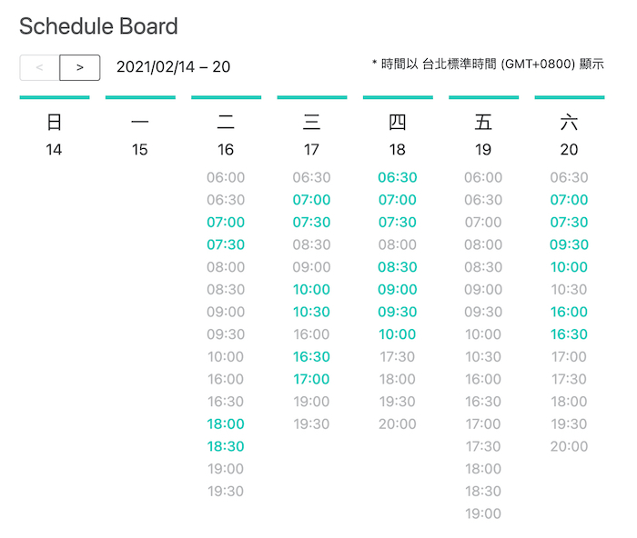

# Week Schedule Board UI



## Run Dev on Local
```
yarn install
yarn start
```

## Run Build on Local

```
yarn global add serve
serve -s build

# should run on 5000 port by default
```

## Environment / Library

- Node v12.14
- create-react-app
- xstate